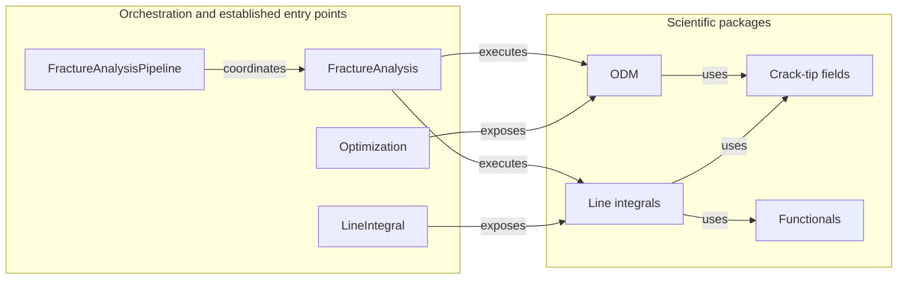

# Fracture Analysis

The `fracture_analysis` package coordinates crack-tip-field evaluation with the Over-Deterministic Method (ODM) and Line-Integral Evaluation Techniques.
`FractureAnalysis` evaluates one nodemap, while `FractureAnalysisPipeline` applies the same analysis contract across a nodemap collection.

## Package Ownership

The diagram records the intended dependency direction between current package seams.

| Package | Responsibility |
| --- | --- |
| [`crack_tip_fields`](crack_tip_fields/README.md) | CJP and Williams bases, coefficient contracts, and derived fracture-mechanics quantities. |
| [`odm`](odm/README.md) | Displacement sampling, linear fitting, Solver Routes, and ODM Technique Results. |
| [`functionals`](functionals/README.md) | Fracture-mechanics expressions evaluated before contour integration. |
| [`line_integrals`](line_integrals/README.md) | Contour geometry, sampled fields, auxiliary fields, integration, and Contour-Wise Results. |

## Analysis Contract

One analysis uses measurement data, material properties, and crack-tip information for the same specimen state and crack-tip coordinate frame.
ODM and Line-Integral Evaluation Techniques retain separate configuration and result contracts.

`FractureAnalysis` exposes authoritative ODM Technique Results and ordered Contour-Wise Results.
The `Optimization` and `LineIntegral` facades provide the established mutable interfaces used by existing callers.

Scientific equations, units, signs, coordinate conventions, and coefficient orderings remain with the owning crack-tip-field or Functional package.
