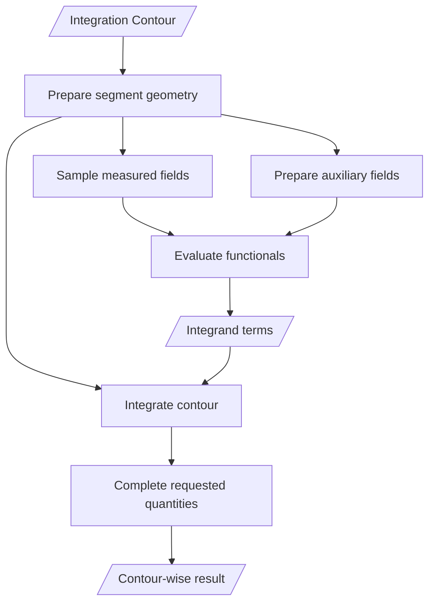

# Line-Integral Analysis

The `line_integrals` package owns contour geometry, contour-field sampling, auxiliary fields, numerical contour integration, technique execution, and immutable contour-wise results.
It combines [`functionals`](../functionals/README.md) with Williams contracts from [`crack_tip_fields`](../crack_tip_fields/README.md).

## Execution Contract

One execution prepares an ordered Integration Contour, samples measured fields at segment midpoints, prepares the requested auxiliary fields, evaluates the selected Functionals, and integrates their contributions in contour order.
`ContourWiseLineIntegralResult` stores the evaluated geometry, requested quantities, and optional Williams coefficients.

The package exposes `IntegrationContour`, `ContourSet`, `IntegrationContourResultGeometry`, `LineIntegralQuantities`, and `ContourWiseLineIntegralResult`.
The established `LineIntegral.integrate_all()` facade returns the authoritative contour-wise result and updates its mutable compatibility attributes.
`FractureAnalysis.contour_results` preserves contour execution order.

## Scientific Invariants

Rectangular contours follow a counter-clockwise segment chain from the lower crack face to the upper crack face.
Geometry preparation derives segment midpoints, signed vertical increments `dy`, positive lengths `ds`, crack-tip polar coordinates, and outward normals.
The outward normal is the clockwise rotation of the directed segment tangent.

Measured and auxiliary fields use the crack-tip coordinate frame.
The x-axis follows prospective crack extension, and the y-axis is normal to the crack plane.
Quadrature applies signed `dy` and positive `ds` to `IntegrandTerms` and sums the contributions in contour order.
Bueckner-Chen evaluation and the contour-wise result preserve the effective requested Williams-term order.

Stress inputs use MPa, displacement and contour lengths use mm, and J-integral results use N/mm.
Reported Stress Intensity Factors use MPa sqrt(m), T-stress uses MPa, and Williams coefficient units depend on term order.

## Scientific References

- Sladek et al. (1997), equations 3-4, DOI [10.1016/S0167-8442(97)00013-X](https://doi.org/10.1016/S0167-8442(97)00013-X), Citation Key `sladek_et_al_1997_contour_integrals`.
- Zhao, Tong, and Byrne (2001), equations 4a-4b, DOI [10.1023/A:1011016720630](https://doi.org/10.1023/A:1011016720630), Citation Key `zhao_et_al_2001_corner_cracks`.
- Molteno and Becker (2015), equations 3, 6, and 9-11, DOI [10.1111/str.12166](https://doi.org/10.1111/str.12166), Citation Key `molteno_becker_2015_j_integral_decomposition`.
- The individual J-integral, interaction-integral, Bueckner-Chen, and Stress-Difference Method sources are recorded with [`functionals`](../functionals/README.md).
