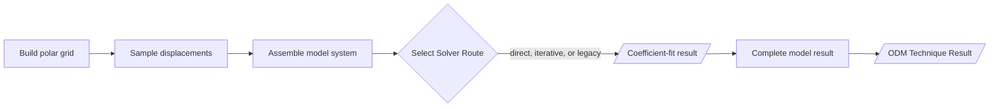

# Over-Deterministic Method

The `odm` package owns displacement sampling, linear fitting-system assembly, fit execution, Solver Routes, numerical fit evidence, and typed Over-Deterministic Method results.
It consumes the CJP and Williams displacement bases owned by [`crack_tip_fields`](../crack_tip_fields/README.md).

## Execution Contract

The package exports `SolverRoute`, `CoefficientFitResult`, and `OdmFitResult`.
The direct route solves an assembled linear system with the GELSS least-squares driver.
The iterative route applies SciPy least squares to the same matrix and exact Jacobian.
The legacy route evaluates the established residual and Jacobian callbacks.

`CoefficientFitResult` owns immutable fitted coefficients, residuals, cost, completion evidence, and available matrix evidence.
`OdmFitResult` combines that evidence with formulation-specific coefficient and quantity contracts.
Its `completed`, `failed`, and `skipped` states describe technique execution.

## Fitting Invariants

One fit keeps the crack-tip position, material properties, polar grid, selected Williams terms, and valid displacement mask fixed.
CJP and Williams displacements are linear in their coefficients under those conditions.

CJP Mode I and mixed-mode systems use one valid in-plane displacement mask while retaining separate coefficient columns.
Williams in-plane and out-of-plane systems retain independent masks and coefficient orders.
In-plane Williams columns contain all selected symmetric coefficients followed by all selected antisymmetric coefficients.

The established `Optimization` facade converts coefficient-fit evidence into independent mutable SciPy results.
Its bounded interpolation cache may reuse sampling geometry across equivalent optimization instances.
`FractureAnalysis` projects authoritative ODM Technique Results through private compatibility adapters at the analysis seam.
